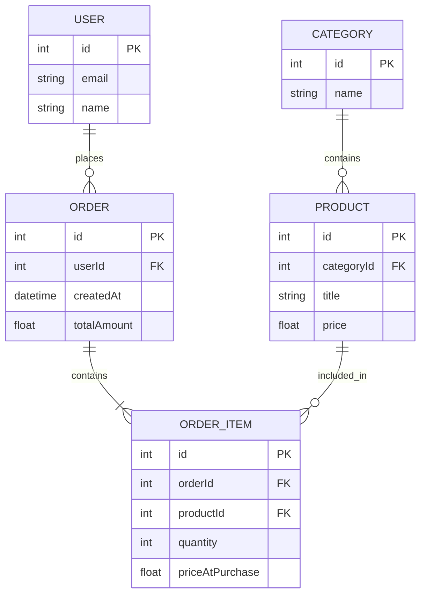

## 1. Опис предметної області 
Інформаційна система "Інтернет-магазин книг" призначена для автоматизації процесу перегляду та придбання книг користувачами.
Система дозволяє користувачам переглядати доступні книги, створювати замовлення та додавати до них необхідні товари. Для кожної книги зберігається інформація про її назву та ціну. Замовлення містить перелік обраних книг, їх кількість та ціну на момент придбання.
Основні сутності предметної області - USER;ORDER;PRODUCT;ORDER_ITEM;CATEGORY;

## 2. ER-DIAGRAM

## 3. Зв'язки між сутностями

- **USER — ORDER (1:N)** — один користувач може створити багато замовлень, але кожне замовлення належить одному користувачу.
- **CATEGORY — PRODUCT (1:N)** — одна категорія може містити багато книг, але кожна книга належить одній категорії.
- **ORDER — ORDER_ITEM (1:N)** — одне замовлення може містити багато позицій, але кожна позиція належить одному замовленню.
- **PRODUCT — ORDER_ITEM (1:N)** — одна книга може входити до багатьох позицій різних замовлень, але кожна позиція стосується однієї книги.
- **ORDER — PRODUCT (M:N)** — одне замовлення може містити багато книг, а одна книга може бути включена до багатьох замовлень. Цей зв'язок реалізовано через проміжну таблицю **ORDER_ITEM**.